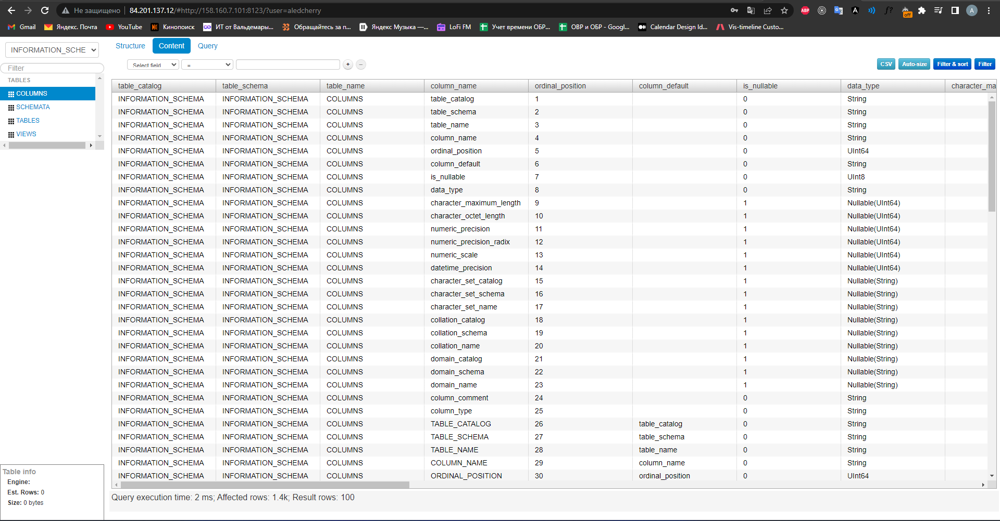

# Домашнее задание к занятию "08.03 Использование Yandex Cloud"

### Решение:

Плейбук содержит четыре плея:
- Install Clickhouse
1. Скачиваем rpm пакеты
2. Устанавливаем пакеты с помощью модуля yum
3. Темплейтим clickhouse файлы(users и config)
4. Запускаем clickhouse-server(через notify)
5. Создаем базу данных clickhouse
- Install Vector
1. Скачиваем vector
2. Устанавливаем vector
3. Темплейтим vector конфиг
4. Создаем папку для логов vector
5. Запускаем vector(через notify)
- Install Nginx

``
На сервере lighthouse разворачиваем nginx, темплейтим его конфиг на сервер и запускаем nginx 
``
- Install lighthouse

``
На сервере lighthouse, клонируем репозиторий lighthouse в папку на сервере, темплейтим конфиг lighthouse для nginx и перезагрудаем nginx
``

### Результат:

